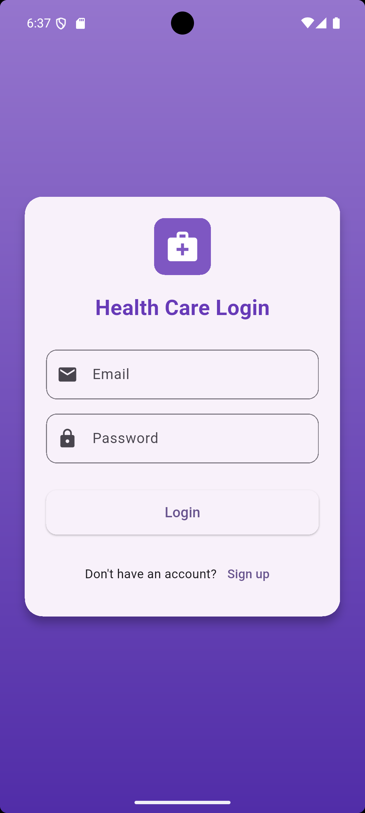
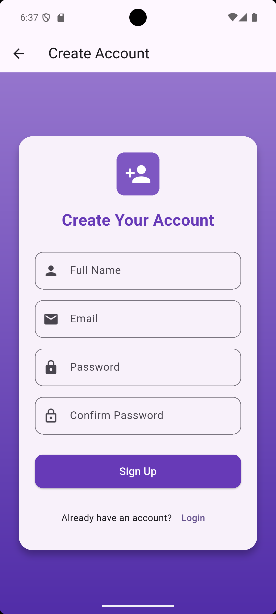
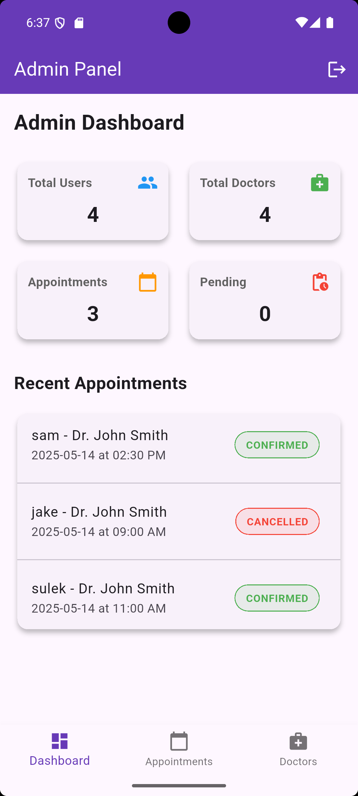
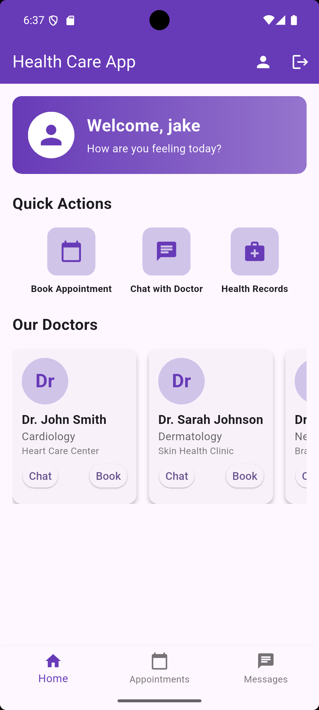
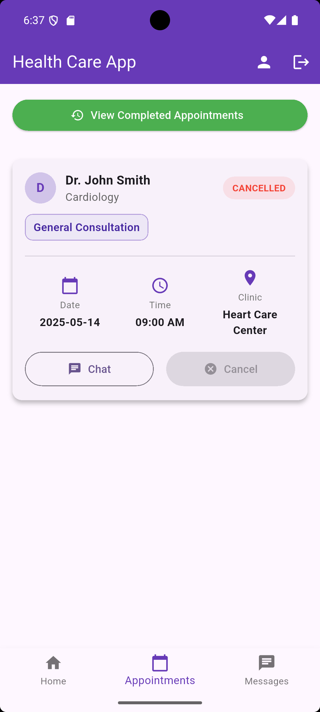
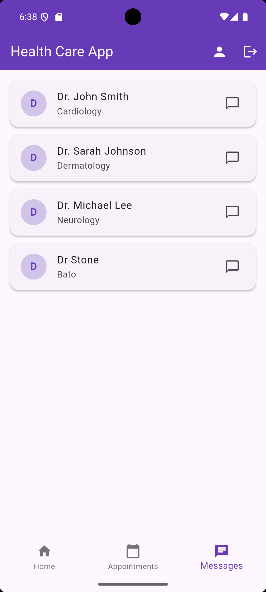

# Healthcare App

A comprehensive mobile healthcare application built with Flutter that enables patients to book appointments with doctors, communicate via chat, and manage their health records.

## Features

- **User Authentication**: Secure login and registration system
- **Doctor Directory**: Browse through available doctors with specialty information
- **Appointment Booking**: Schedule appointments with preferred doctors
- **Appointment Types**: Various appointment types including General Consultation, Blood Tests, X-Ray Scans, etc.
- **Payment System**: Multiple payment options including Cash, GCash, and Credit Card
- **Chat System**: Direct messaging between patients and doctors
- **User Profiles**: Personalized user profiles with appointment history
- **Admin Panel**: Administrative interface for managing doctors, appointments, and users
- **Appointment History**: Track completed and upcoming appointments
- **Offline Capability**: Local SQLite database for data persistence

## Screenshots

### User Interface






### Admin Panel


### Patient Experience




## Installation

### Prerequisites
- Flutter SDK (>=3.0.0)
- Dart SDK (>=2.19.0)
- Android Studio / VS Code
- Android SDK / iOS Development Tools

### Steps
1. Clone the repository:
   ```
   git clone https://github.com/yourusername/healthcare.git
   ```

2. Navigate to the project directory:
   ```
   cd healthcare
   ```

3. Install dependencies:
   ```
   flutter pub get
   ```

4. Run the application:
   ```
   flutter run
   ```

## Usage

### Patient Account
1. Register a new account or login with existing credentials
2. Browse available doctors in the home screen
3. Book an appointment with your preferred doctor
4. Select appointment type, date, and time
5. Process payment for the appointment
6. Chat with your doctor for consultations
7. View your appointment history and profile information

### Admin Account
- Login with admin credentials (Default: username: `admin`, password: `123qwe`)
- Manage doctors (add, update, delete)
- Create appointments for patients
- View and update appointment status
- Monitor overall system statistics

## Technologies Used

- **Frontend**: Flutter
- **State Management**: Flutter's built-in state management
- **Database**: SQLite (local storage)
- **Packages**:
  - sqflite: For database operations
  - intl: For date formatting
  - path: For file path management

## Project Structure

```
healthcare/
├── lib/
│   ├── models/           # Data models
│   ├── screens/          # UI screens
│   ├── utils/            # Utility functions and helpers
│   └── main.dart         # Entry point
├── assets/               # Images and other resources
└── test/                 # Unit and widget tests
```

## Future Improvements

- Cloud synchronization for data
- Push notifications for appointment reminders
- Telemedicine video consultations
- Patient medical records management
- Prescription management
- Integration with wearable health devices
- Analytics for health trends

## License

This project is licensed under the MIT License - see the LICENSE file for details.

## Contributors

- [Your Name](https://github.com/edriccoder)

## Acknowledgments

- Flutter Team for the amazing framework
- All open-source contributors
